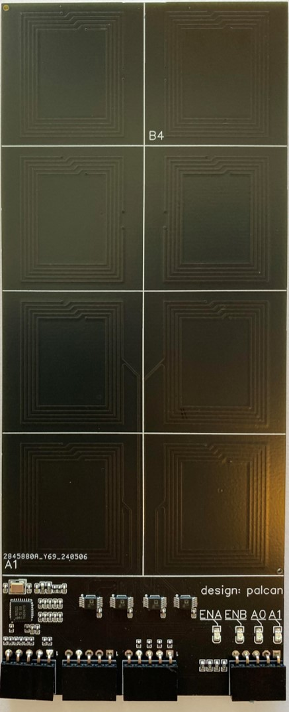
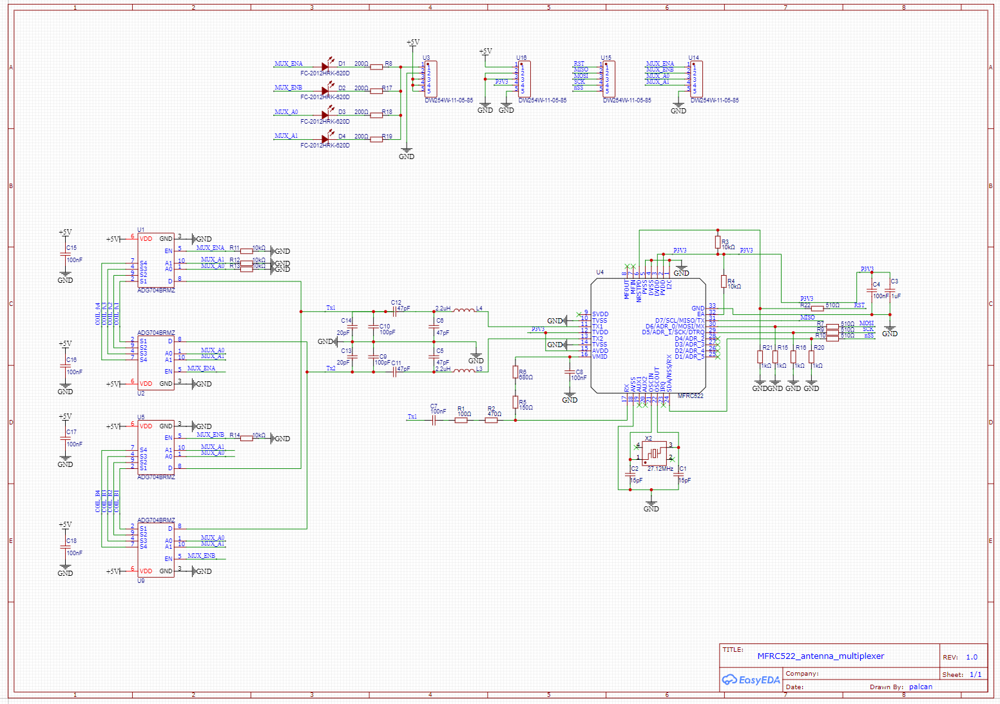
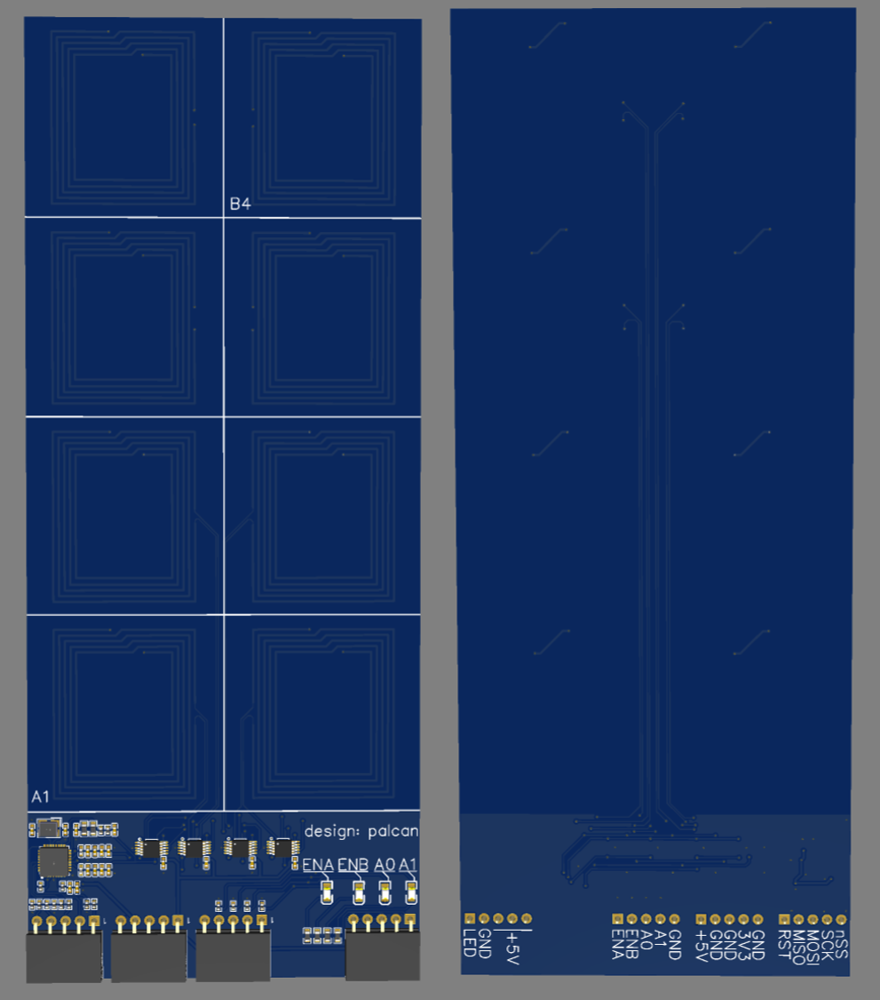
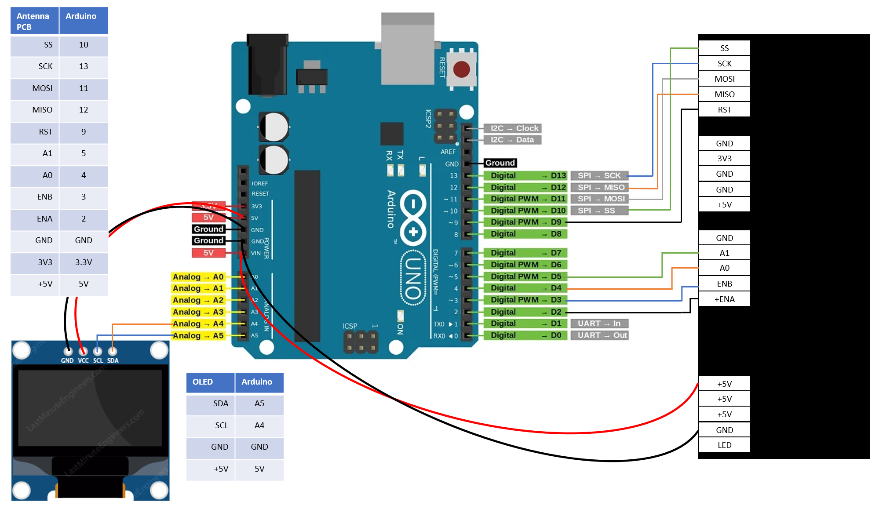
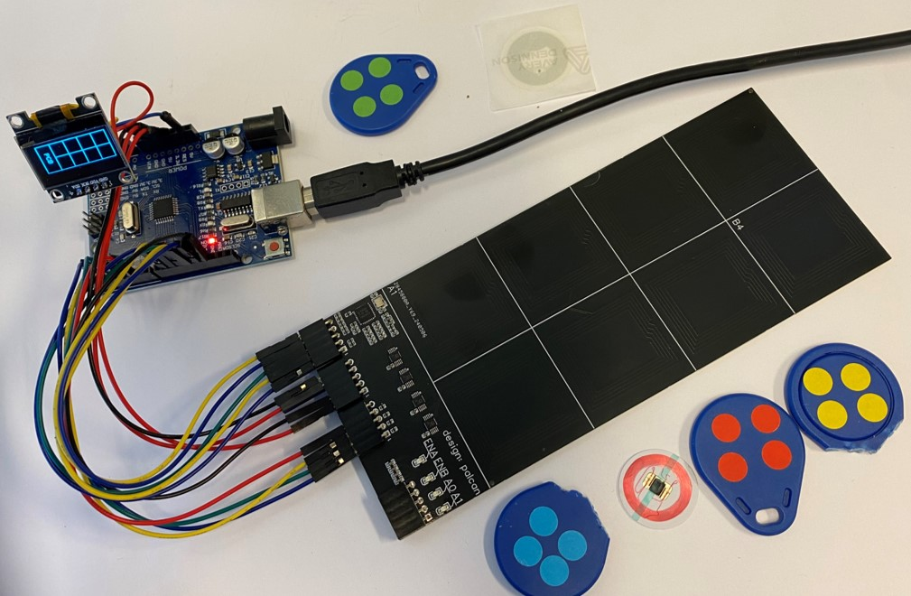
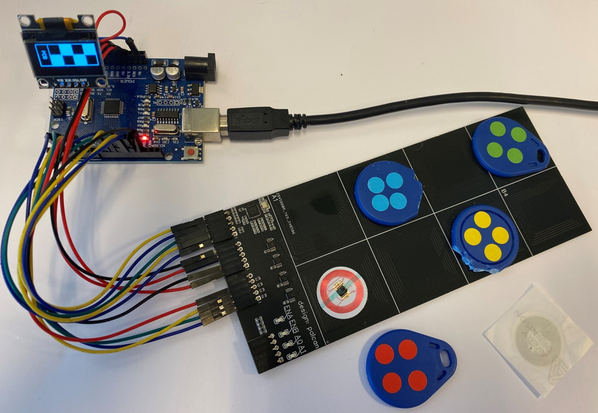
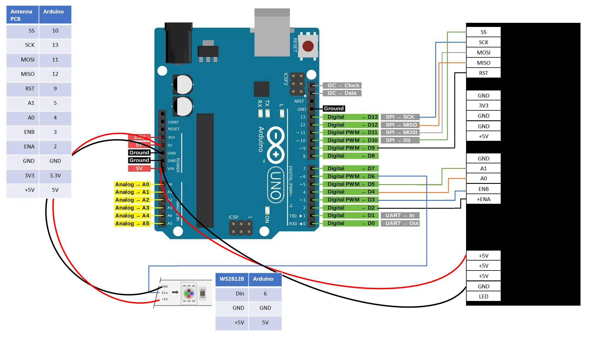
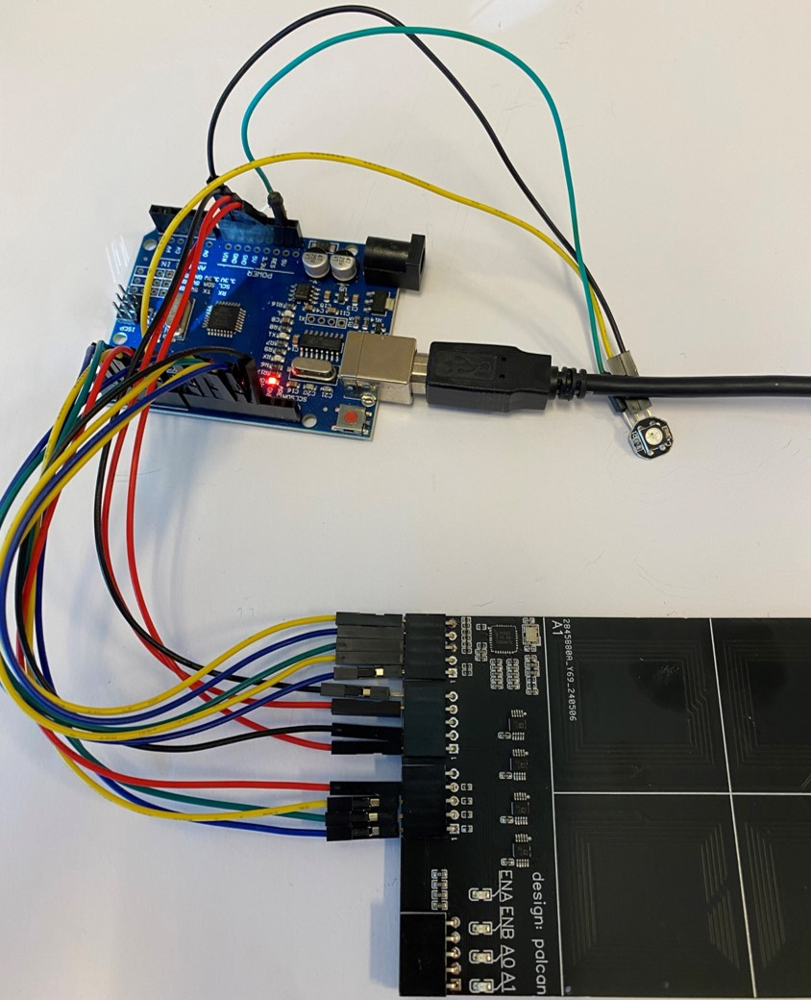
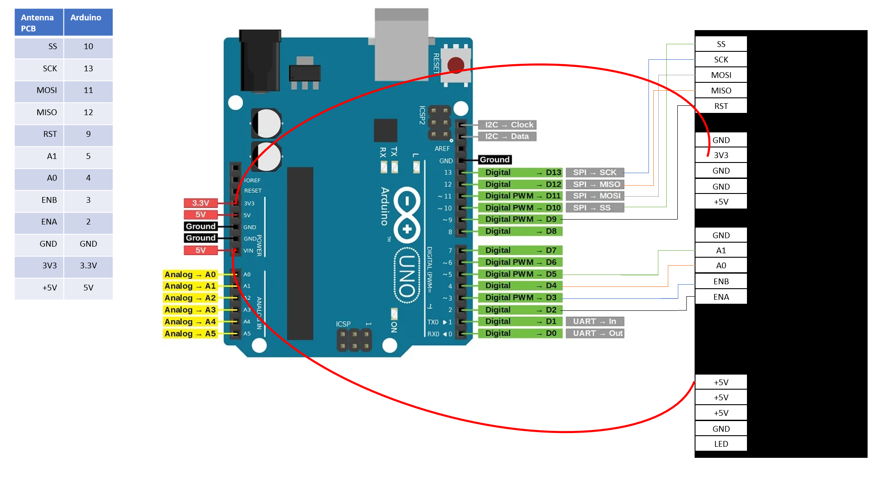
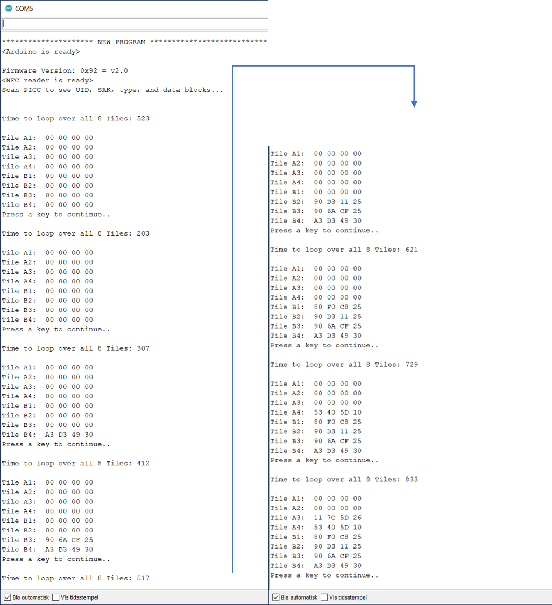

# Multiplexing-NFC-MFRC522-Antennas
Custom PCB with 1x NFC frontend chip MFRC522 and 4x Antenna, using an analog multiplexer to select one antenna at the time

  

- A general description of the project:
  - _The project is intended to demonstrate a solution for reading simple Mifare tags throughout a multiplexed antenna matrix with just one NFC reader. It employs a custom PCB with a single NFC frontend chip MFRC522 and 8x PCB Antenna, with analog multiplexers to switch between the antennas. Both the SPI interface and the control signals for the multiplexers are made available for an Arduino board._
  - _See my other repo, [Multiplexing MFRC522 NFC Modules](https://github.com/palcan/Multiplexing-MFRC522-NFC-Modules/tree/main), for details on the previous project where 4x reader chips were multiplexed. This project differs as it uses only 1x reader chip, and instead multiplexes 8x antennas_

- The project status:
  - _The project is finished, and intended to be reused, in some form, in a new project for multiplexing 8x (or more?) new standalone antenna units. This project can be found in a new repo some time in the future. The code in this repo will not be further updated._
     
- The requirements on the development environment for integration:
  - _I've used plain Aurdiono IDE (version 1.8.13) for the code. The code should work fine with any Arduino board that has HW SPI and runs on 5V. The LEDs used in one of the demos are the common WS2812B type, that probably can be interchanged with any other LED strips based on the WS2812B, such as neopixels_
  
- A guide to installation and use:
  - _The Arduino IDE downloads and use is extensively documented by Arduino.cc._
  - _The entries in the code where the red, blue, green, etc. tag ID's are set must be changed to the IDs of your own tags that you will be using_
  - _The specs for the Arduino Uno R3 can be found with a simple internet search_
  - _The library in use can be found through normal library search in the Arduino IDE (if you don't know how, there's info on Arduino.cc that explains that much better than me). The link to the library Github page is https://github.com/miguelbalboa/rfid/tree/master. The libraries used in the OLED display demo can be found through the guide at https://lastminuteengineers.com/oled-display-arduino-tutorial/_

- A list of technology used and any links to further information related to this technology:
  - _Much of the technology used (what we can call technology in this context) is readily available in uncounted sources a quick google search away. Keywords are_
    - _SPI_
    - _I2C_
    - _OLED Display_
    - _Arduino Uno R3_
    - _Arduino IDE_
    - _Neopixel_
  - _For a deeper understanding of NFC there's multiple primers out there that can be helpful, I used the educational material available from NXP and STMicro quite a bit, and read through a few of the examples on connecting Arduino to RC522 (Lots of videos on Youtube on this)_

- Known bugs and any bug fixes:
  - _No bugs yet_
  - _As an added feature to later revisions, I'd consider adding a Hall sensor under each antenna coil, so that I can investigate the impact on NFC sensing of having a magnet and coil stacked together. The idea is that Hall sensing is quick while NFC reading is comparably very slow, and it therefore allows for selective NFC reading at specific locations where the presence of a magnet indicates that a tag can be found. In a larger array with many more antennas, you ideally don't want to have to scan through all of them to just catch one change in the array state. This will also let me evaluate if the addition of a permanent magnet will degrade the sensing of NFC tag._
    
- FAQ section with all previously asked questions:
  - _Nobody has asked anything yet...!_
 
- Copyright and licensing information:
  - _See the license file in this repo_

## Table of Contents
[Introduction](#Introduction)  
[Design](#Design)  
[Test with OLED Display](#Testing-multiplexing-of-the-antennas---I2C-OLED-Display)  
[Test with LED](#Testing-multiplexing-of-the-antennas---LEDs)  
[Test of reading speed](#Testing-multiplexing-speed-of-the-antennas---Console)  

## Introduction

Having had some success playing around with NFC modules (creating my own design, and getting multiple readers to work together) I decided to tackle what I saw as the next hurdle. The issue is that the NFC frontend reader chips are too expensive to use many of them in a design. The antennas on the other hand, are just PCB area, and therefore much cheaper. So if you want multiple unique identifications areas on a design or product at a reasonable price - multiplexing antennas seems like the best path forward. I went for a custom designed PCB right away, as I didn't have any of the components readily available that would have made it possible to breadboard. This is a bit more risky and costly, but I felt the risk was mitigated quite at bit as it basically came down to re-using the design from my previous custom MFRC522 design (see my other repo, [Custom MFRC522 Board Design](https://github.com/palcan/Custom-MFRC522-Board-Design), for all the details on the custom designed MFRC522 NFC module) and placing Analog Mux'es between the antenna coils and the matching network of the MFRC522 chip. 

[Back to Table of Contents](#Table-of-Contents)  

## Design

As usual, the design was done with the EASY EDA software, as the integration with LCSC parts library and JLPCB's PCB and Assembly service, combined with the pricing offered, is still the best I can find. Below follows the schematic and a design description.

*MFRC522 antenna multiplexer design SCHEMATIC*

- Please refer to my previous custom MFRC522 design (see my other repo, [Custom MFRC522 Board Design](https://github.com/palcan/Custom-MFRC522-Board-Design) for all the details on the circuitry designed around the MFRC522 NFC chip. An addition is made here with resistive divider networks on the SS, SCK, RST and MOSI pins  to protect the 3V3 interface from the Arduinos 5V logic levels.  
- The 4x 5-pin Connectors exposes the SPIO pins, the control signals for the analog multiplexers, power and gnd input, and last is a debug option where shorting pin 1 and 2 on connector U3 will enable the Leds which let you visually see the state of the control signals for the multiplexers.
- The analog mux chosen is ADG704BRMZ. It's a 1-to-4 decoder with worst-case 4 ohm channel resistance (typically only 2.5 ohm) at room temperature with a 5V supply. This was the best compromise between price, and availability at JLCPCB, and lowest possible on-resistance, that I found. It has up to -60dB Off Isoltaion and 200Mhz bandwidth, which I believe to be sufficient. The capacitive loading also seems to be acceptably low, as a few multiples of ~50 pF probably won't affect the impedance matching network noticeably. Having the Enable/Not-Enable option means many of these could be used as a way to multiplex even more antennas (next project..?) with just adding one more digital signal for each block of four antennas.

The PCB design uses a 2-layer stack up where the area not occupied by the antennas employs GND pours on top and bottom layers, and 5V and 3V3 is routed with thick traces on top layer. Signal Routing is done on primarily Top and sparingly on Bottom layer, to keep the ground plane as continuous as possible. The area the antennas occupy are free of any copper except a few signal traces. The antennas are designed in a rectangle shape to provide enough space for routing traces in between the antennas. The width of the antenna tracks and number of turns and spacing between turns is the main factors to use for tuning the impedance of the antenna.

*3d Render of Assembled PCB, left: TOP, right: BOTTOM*

[Back to Table of Contents](#Table-of-Contents)  

## Testing multiplexing of the antennas - I2C OLED Display
The first test was basically hooking up everything and seeing that the multiplexing action worked. I wrote some quick code that looped over all 8x antennas and showed which tile was occupied by wich tag-ID and which was not. I've added the very common 0.96 inch I2C OLED screen to show how a small display can be used in a standalone setup to visualize which tile has tags present and which are empty, instead of having to connect to a PC with a terminal. 

The code can be found under the Code folder Code/OLED_Display_Demo.

*Wiring diagram for the Arduino, the antenna PCB, and the OLED display*
  

*The setup ready to be tested*

*Showing the effect on the OLED display of having four of the tiles occupied by TAGs*

*Showing the effect on the OLED display of having the various tiles occupied by various TAGs*

[Back to Table of Contents](#Table-of-Contents)  

## Testing multiplexing of the antennas - LEDs
The second test was intended to show how RGB leds can be used in a standalone setup to visualize which tile has tags present and which are empty, instead of having to connect to a PC with a terminal. An added level of "complexity" is having the LEDs color be dependent on which tag is present. 

The code can be found under the Code folder Code/LEDS_Demo.

*Wiring diagram for the Arduino, the antenna PCB, and the WS2812B RGB led*

*The setup ready to be tested*

*Showing the effect on the LED of having the A1 tile occupied by the various color-coded TAGs*

[Back to Table of Contents](#Table-of-Contents)  

## Testing multiplexing speed of the antennas - Console
The third test timed the execution of one full loop and the effect of having/not having a tag present. 

The code can be found under the Code folder Code/Console_Demo.

*Wiring diagram for the Arduino and the antenna PCB*

The results showed the following reading speeds/times

*Console output for succesively adding more and more TAGs*

Giving us the following
- No Tags present:   203 ms
- 1x Tag present:    307 ms  --> 104 ms added for reading tag
- 2x Tags present:   412 ms  --> 105 ms added for reading tag
- 3x Tags present:   517 ms  --> 105 ms added for reading tag
- 4x Tags present:   621 ms  --> 104 ms added for reading tag
- 5x Tags present:   729 ms  --> 108 ms added for reading tag
- 6x Tags present:   833 ms  --> 104 ms added for reading tag
- ... Ran out of tags - didn't test for 7x and 8x

Giving a accumulated switching time for swithing through all the antennas, and timing out when looking for (and not finding) a tag on each tile, of 203 ms. Thats about 25 ms. each tile. The time spent on a tile if a tag is found goes up from approx. 25 ms. to approx. 130 ms. (25 ms + 105 ms) due to communication with the Tag for reading out the basic ID information. So there's a baseline time for looping over all antennas that is approx 203 ms., and an added time of approx. 105 ms. for each tag present on the antenna matrix. The variance seen through multiple tests is between a minimum of 103 ms and maximum of 110 ms - with 104 ms and 105 ms occuring about 90% - 95% of the time.

[Back to Table of Contents](#Table-of-Contents)  

